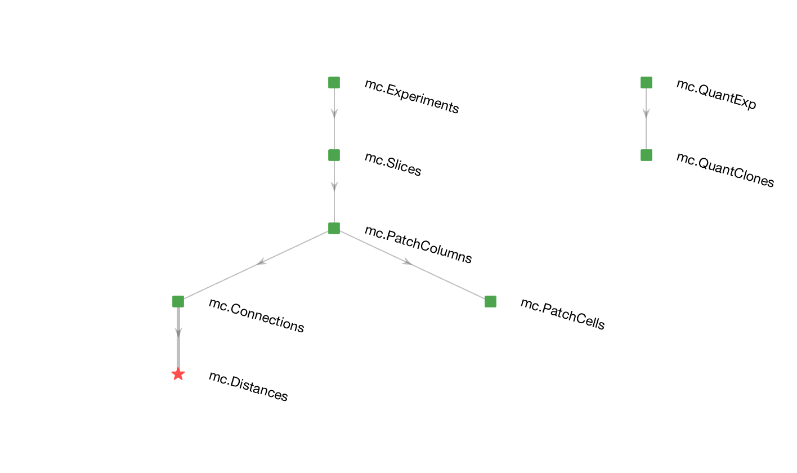

Overview
========

This repository contains the Matlab, R and Python code used to analyze data and generate figures in Cadwell et al., _Cell type composition and circuit organization of clonally related excitatory neurons in the juvenile mouse neocortex_, eLife (2020). 

License
=======

Copyright 2020 C. R. Cadwell

   Licensed under the Apache License, Version 2.0 (the "License");
   you may not use this file except in compliance with the License.
   You may obtain a copy of the License at

       http://www.apache.org/licenses/LICENSE-2.0

   Unless required by applicable law or agreed to in writing, software
   distributed under the License is distributed on an "AS IS" BASIS,
   WITHOUT WARRANTIES OR CONDITIONS OF ANY KIND, either express or implied.
   See the License for the specific language governing permissions and
   limitations under the License.
   
General Organization
====================

For quantitative analysis of clones and connectivity data, we used the Matlab implementation of [DataJoint](https://github.com/datajoint), which utilizes a relational database model for organizing, populating, and querying data. The DataJoint schemas are archived at atlab/commons and the critical tables for our analyses are described below.  

Analysis of gene expression data was performed in R Bioconductor using custom software and previously developed packages including `scran`.

Modeling of the cortical circuit was done in Python using Jupyter Notebook.

For efficiency, the data were stored at intermediated stages of analysis as .mat, .txt, or .csv files. 

Files related to Figure 1
-------------------------

### Reconstruction of clones across slices (analyses used for Figure 1)
Tile scan Z-stacks of entire coronal sections were first maximially projected using the commercial acquisition software for the microscope. The positions of labeled cells were annotated using the following Matlab-based custom software:
* `Segmentation.m` This code selects one maximally projected coronal section at a time, and has the user  manually outline the contours of the cortex, and mark the positions of cortical neurons by presenting small patches of the cortex area. The positions of annotated cortical neurons are saved to a separate file.  
* `showImages.m` This code shows all annotated coronal sections for an entire mouse brain, including the outlines of the cortex and positions of the neurons identified above. The user can scroll through the slices to see how individual clones appear on adjacent sections. These images are aligned manually across slices to visualize reconstructed clones shown in Figure 1B,C and Figure 1-supplement 1A,B.

### Quantification of clones at P10 and E12.5
* `CountCells.m` While active, this code will count the number of annotated neurons within an area selected by the user, while viewing an annotated coronal section.
* `CloneQuantificaiton.mat` Saved variables used to generate Figure 1D-F and Figure 1-supplement 1C,D.
* `Figure1D-J S1CD.m` Code to generate Figure 1D-F,I,J and Figure 1-supplement 1C,D

Files related to Figure 2
-------------------------

### Quality control of single-cell RNA-seq data, visualization using t-SNE, and generalized linear models to predict layer or region from gene expression data
* `Figure2C-H S1 S2.rtf` Code to run in R Bioconductor to generate panels for Figure 2C-H, Figure 2-supplement 1 and Figure 2-supplement 2.
* `countdata.txt`, `samplelist.txt`, `genelist.txt`, and `annotations.txt` Input data needed to run ananlysis and generate figure panels using above script in R. 
* All other files in this folder are final or intermediate outputs of the above R script. 

Files related to Figure 3
-------------------------

### PENDING DMITRY TO ADD HERE

### `data.mat` 
Contains the raw data (normalized logcounts,`counts`) and metadata for each of the 206 samples included in our Patch-seq dataset. Metadata includes the following pieces of information about each cell:
* `exp` Experiment number.
* `fp` Firing pattern.
* `genes` Gene names for the data included in `counts`.
* `label` Indicates whether the cell was labeled by a fluroscent indicator (`positive`) or not (`negative`).
* `layer` Layer position of the cell.
* `region` Brain region, if known (`V1` = primary visual cortex, `SS1` = primary somatosensory cortex).
* `sample` Unique sample ID.
* `slice` Slice number (numbering restarted for each animal).
* `subject` Unique animal ID. 

### `allenData.mat` 
Contains our t-SNE projection data for the reference dataset from Tasic et al.2018.
* `allentsne` Contains the x and y t-SNE corrdinates for each cell in the reference atlas. The third column is the cluster ID. 
* `allentsneNames` Names of cell clusters for each cell in the reference atlas.
* `allentsneColor` RGB values for each cell in the reference atlas. 

### `columnProjection.mat` 
Contains the t-SNE projection data for mapping our Patch-seq dataset onto the reference atlas.
* `cProj` Contains the x and y t-SNE coordinates for each cell in our Patch-seq dataset. The third column is a measure of uncertainty of the mapping (see Methods section of paper for how this is computed, larger values indicate greater uncertainty).

### `classAssignments.mat` 
Shows the best matching transcriptomic cluster in the reference atlas for each cell in our Patch-seq dataset. Cluster names and cluster IDs are the same as those used in Tasic et al., 2018. 
* `class` Name of the best-matched transcriptomic cluster for each Patch-seq cell.
* `classID` Cluster ID of the best-matched transcriptomic cluster for each Patch-seq cell. 

### `Figure3.m` 
Script for generating figure panels in Figure 3, Figure 3-supplement 1, and Figure 3-supplement 2. 

Files related to Figures 4 and 5 and Table 1
--------------------------------------
### Analysis of layer-specific connectivity rates (Figures 4 and 5)
* `Sort.m` Code for sorting connectivity data into layer-specific groups, a 3x3 matrix representing each layer combination.
* `Groups.mat` Connections sorted into layer-specific groups.
* `allCounts.mat` Summary of number of connections, with a 3x3 matric for each layer combination in each of the following categories:
   - `biConnR`: Related pairs with bidirectional connections.
   - `biConnU`: Unrelated pairs with bidirectional connections. 
   - `biUnconnR`: Related pairs without bidirenctional connections. 
   - `biUnconnU`: Unrelated pairs without bidirectional connections. 
   - `connR`: Related pairs with connection.
   - `connU`: Unrelated pairs with connection.
   - `unconnR`: Related pairs without connection. 
   - `unconnU`: Unrelated pairs without connection.   

### Simple model of connectivity (Figure 4G and 5E)
* PENDING FABIAN TO ADD HERE
* `expected_input_2019-06-04_FS.csv` Output of model using a range of parameters. 

### Analysis of connectivity using distance-matched controls (Figure 5 - supplement 2)
* `Resample.m` Code for generating resampled data.
* `ResampledData.mat` Resampled data generated using `Resample.m`.
* `TwoSided.m` Code to generate two-sided p-values for resampled data. 
* `TwoSided.mat` Two sided p-values generated using `TwoSided.m`. 

### Power analysis (Figure 5 - Supplement 1)
* `PowerAnalysis.rtf` Code used for power analysis in R.
* `Power`, `FoldChange`, and `Prl` are output of 'PowerAnalysis.rtf`. 

### Figure panels
* `Figures4DEFG5CDEFS2S3.m` Code to generate Figure 4D-G, Figure 5C-F, Figure 5-supplement 2,  Figure 5-supplement 3, and generalized linear model shown in Table 1.
* `Figure5S1` Code to generate Figure 5 - supplement 1. 

Util
----
Custom-written functions used by multiple files above:

### `ChiSquared.m` 
Computes the Chi-squared test statistic and p-value.

DataJoint database structure
----------------------------

### Schema `mc`

Detailed table definitions can be found at [`atlab/commons`](https://github.com/atlab/commons/schemas/mc)

